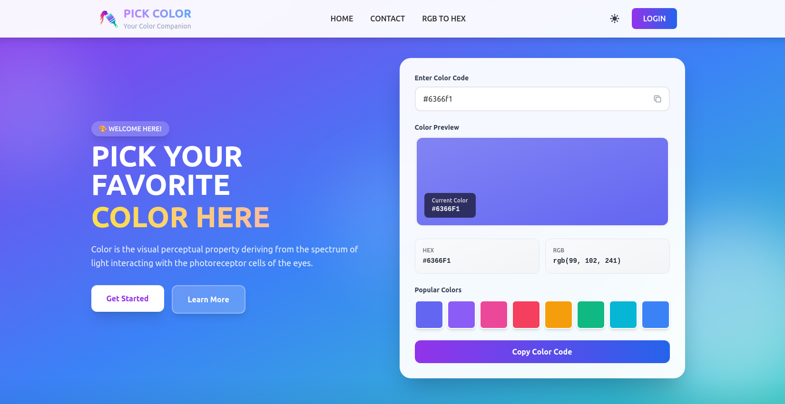

# Pick Color Tool — Landing Page

  
  
  
  
  
  **Pick Color Tool is a simple and user-friendly web application that allows users to easily pick, preview, and copy color values in HEX and RGB formats.**
  
  [Live Demo](https://pick-color-update.netlify.app/) · [Report Bug](https://github.com/electra51/pick-color/issues) · [Request Feature](https://github.com/electra51/pick-color/issues)

---

## Preview

  

---
